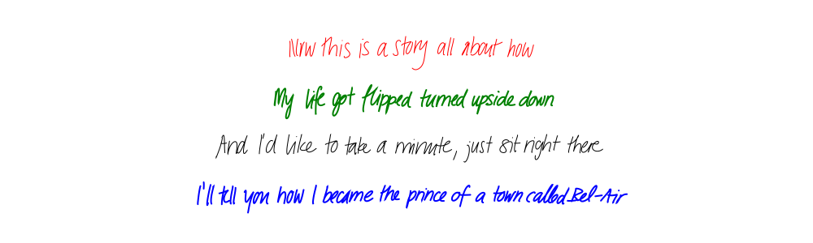

# Handwriting Synthesis

Generate realistic handwriting using a neural network trained on real handwriting samples.

> **This is a modernized fork of the excellent [handwriting-synthesis](https://github.com/sjvasquez/handwriting-synthesis) project by [Sean Vasquez](https://github.com/sjvasquez).** The original implementation is a faithful reproduction of Alex Graves' groundbreaking paper on handwriting generation and remains one of the best open-source implementations available. This fork updates the codebase to work with modern Python/TensorFlow and adds an interactive web dashboard.

## What's New in This Fork

### Modern TensorFlow Compatibility
The original project was built for TensorFlow 1.x. This fork updates the codebase to work with **TensorFlow 2.x** while preserving the original pre-trained model weights. Key changes include:

- Updated LSTM cell implementation to use Keras-compatible layers
- Fixed checkpoint loading with proper LSTM gate reordering (TF1 uses `[i,c,f,o]` gate order, Keras uses `[i,f,c,o]`)
- Added forget bias compensation for proper LSTM behavior
- Maintained full compatibility with the original pre-trained weights

### Interactive Web Dashboard
A new **Gradio-based web interface** makes it easy to generate handwriting without writing any code:

- **13 handwriting styles** to choose from
- **Adjustable neatness** (bias) slider
- **Custom colors** and stroke widths
- **SVG download** for vector graphics
- **Real-time preview** of generated handwriting



## Quick Start

### Installation

```bash
# Clone this repository
git clone https://github.com/more-hangouts/handwriting-synthesis.git
cd handwriting-synthesis

# Install dependencies
pip install -r requirements.txt
```

### Run the Web Dashboard

```bash
python app.py
```

Then open http://localhost:7860 in your browser.

### Use Programmatically

```python
from demo import Hand

hand = Hand()
hand.write(
    filename='output.svg',
    lines=[
        "Now this is a story all about how",
        "My life got flipped turned upside down",
    ],
    biases=[0.75, 0.75],      # Neatness (0=wild, 1=neat)
    styles=[9, 9],             # Style number (0-12) or None for random
    stroke_colors=['black', 'blue'],
    stroke_widths=[2, 2]
)
```

## Customizing the Dashboard

The web dashboard is built with [Gradio](https://gradio.app/), making it easy to modify. The main file is `app.py`.

### Adding New Features

```python
# Example: Add a new input control
with gr.Row():
    my_input = gr.Slider(
        label="My Custom Control",
        minimum=0,
        maximum=100,
        value=50
    )

# Then use it in the generate function
def generate_handwriting(text, style, bias, color, stroke_width, my_value):
    # Use my_value in your logic
    ...
```

### Changing the Default Style

Edit the `value` parameter in `app.py`:

```python
style_input = gr.Dropdown(
    choices=["Random"] + [f"Style {i}" for i in range(13)],
    value="Style 5",  # Change default style here
)
```

### Deploying to the Web

Gradio makes it easy to share your dashboard:

```python
app.launch(share=True)  # Creates a public URL
```

For production deployment, consider [Hugging Face Spaces](https://huggingface.co/spaces) or your own server.

## How It Works

This project implements the handwriting synthesis model from Alex Graves' paper [Generating Sequences with Recurrent Neural Networks](https://arxiv.org/abs/1308.0850).

### Architecture

1. **LSTM Network**: Three stacked LSTM layers process input text character by character
2. **Attention Mechanism**: Gaussian mixture attention aligns the text input with pen strokes
3. **Output Layer**: Mixture Density Network outputs parameters for pen position and stroke endings
4. **Sampling**: The model samples from the predicted distributions to generate handwriting

### Key Files

| File | Description |
|------|-------------|
| `app.py` | Gradio web dashboard |
| `demo.py` | Core `Hand` class for generating handwriting |
| `rnn.py` | Neural network model definition |
| `rnn_cell.py` | Custom LSTM attention cell |
| `rnn_ops.py` | Low-level RNN operations |
| `tf_base_model.py` | Base model with checkpoint loading |
| `drawing.py` | Stroke processing and rendering utilities |

### Pre-trained Model

The included checkpoint (`checkpoints/model-17900`) was trained on the [IAM On-Line Handwriting Database](https://fki.tic.heia-fr.ch/databases/iam-on-line-handwriting-database). The model learned from thousands of real handwriting samples to capture natural variation in letter shapes, connections, and spacing.

## Demonstrations

### Demo #1: Fixed Style
Generated with Style 12 and bias 0.75.

**Smash Mouth – All Star**


### Demo #2: Varying Styles
Each verse uses a different handwriting style.

**Vanessa Carlton – A Thousand Miles**


### Demo #3: Varying Bias
Each verse has decreasing bias (neatness), with the last being completely unbiased.

**Leonard Cohen – Hallelujah**


## Valid Characters

The model supports:
- Letters: `a-z`, `A-Z`
- Numbers: `0-9`
- Punctuation: `space ! " # ' ( ) , - . : ; ?`

## Troubleshooting

### "Module not found" errors
Make sure all dependencies are installed:
```bash
pip install tensorflow tensorflow-probability gradio svgwrite numpy scipy matplotlib
```

### Garbled output
If the handwriting looks like random dots, ensure you're using this fork's updated checkpoint loading code. The original checkpoint requires gate reordering for Keras compatibility.

### Slow generation
The first generation may be slow as TensorFlow initializes. Subsequent generations will be faster.

## Credits

- **Original Project**: [sjvasquez/handwriting-synthesis](https://github.com/sjvasquez/handwriting-synthesis) by Sean Vasquez
- **Paper**: [Generating Sequences with Recurrent Neural Networks](https://arxiv.org/abs/1308.0850) by Alex Graves
- **Training Data**: [IAM On-Line Handwriting Database](https://fki.tic.heia-fr.ch/databases/iam-on-line-handwriting-database)

## License

This project maintains the same license as the original. See the original repository for details.

---

*If you find this useful, please star the [original project](https://github.com/sjvasquez/handwriting-synthesis) as well!*
